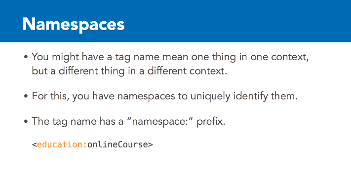
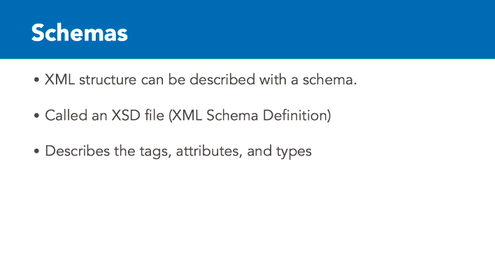
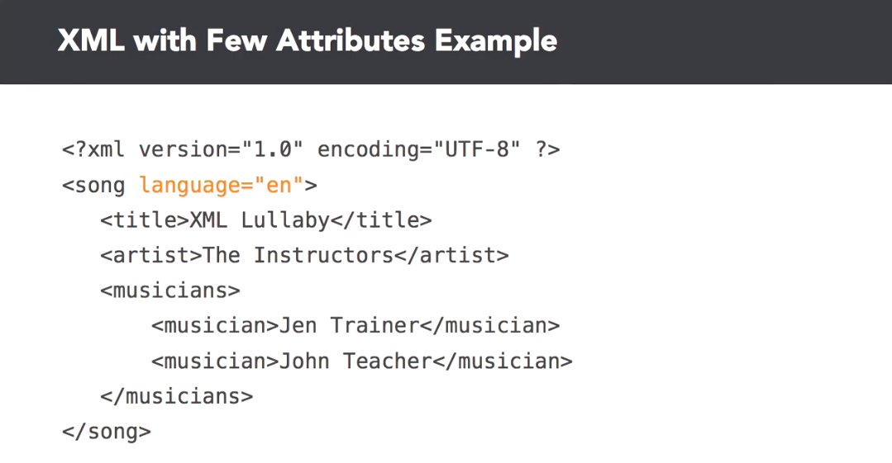
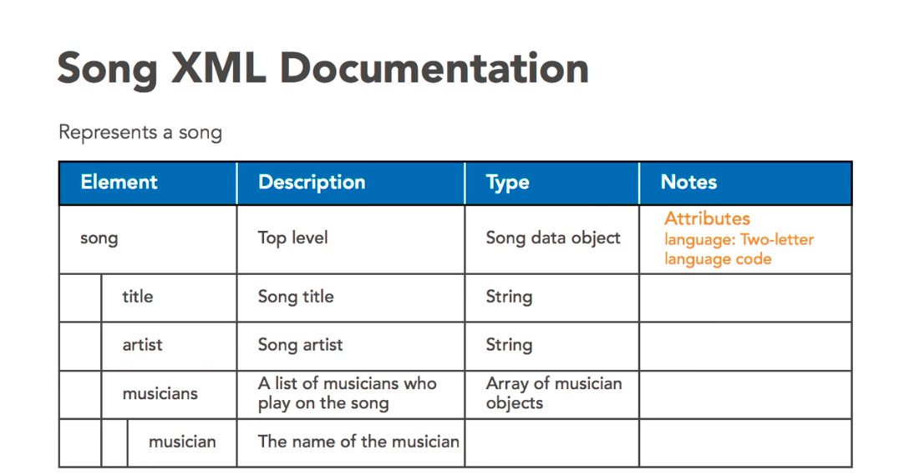
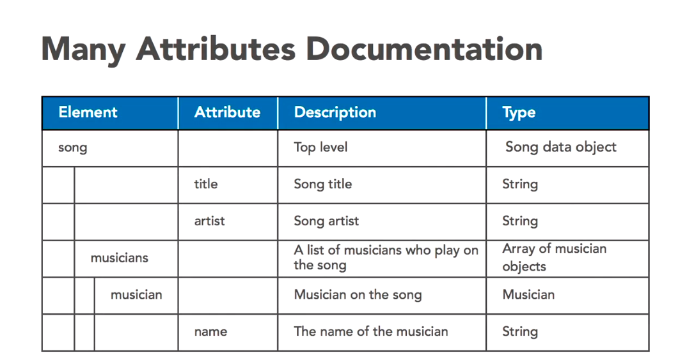
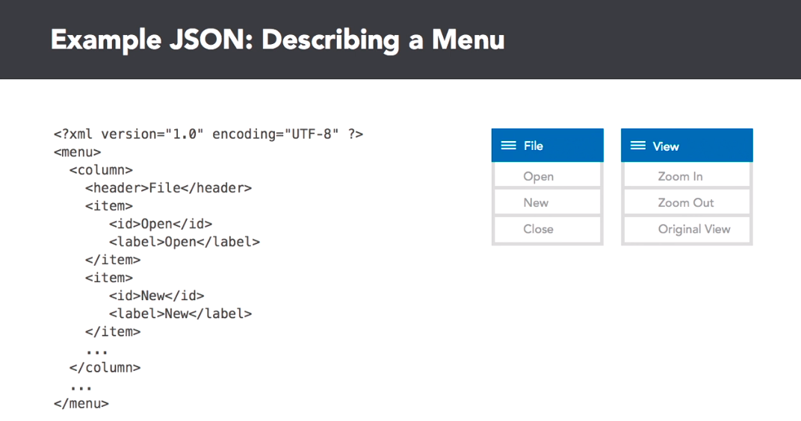
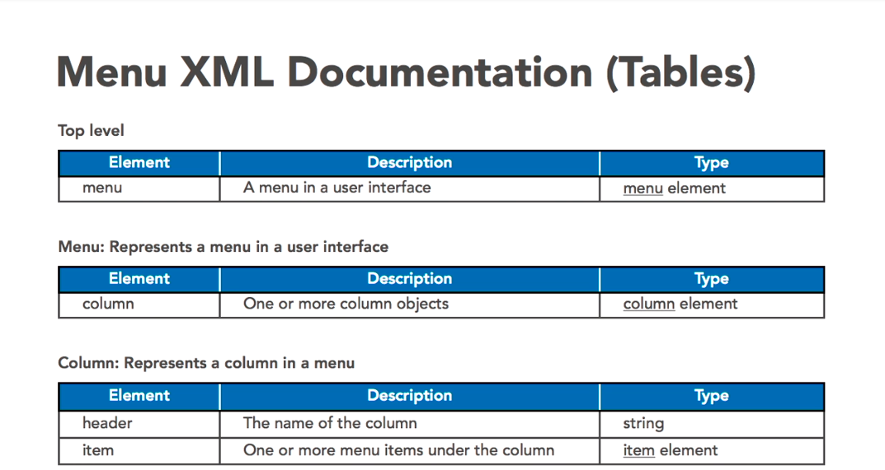

# JSON and XML documentation

- [Collection of public APIs](https://www.programmableweb.com/)

---

# Markdown

- use pipe (|) for columns
- use dashes (-) to separate the header row
  |Name | Description
  |---|---|
  |Apple|Awesome Fruit
  |Orange|Full of viatamins

- [Stackedit](https://stackedit.io/) online markdown editor

- use `>` for quote.
  > this is quote
  >
  > ## this is h2 quote
- this is just `<inline quote>`
- [Daring Firball](https://daringfireball.net/projects/markdown/) Markdown project and syntax
- [Github Markdown](https://guides.github.com/features/mastering-markdown/) guides

---

# XML

### Namespace

### Schema

#### Tools

- [Freeformater Tool](https://www.freeformatter.com/xml-formatter.html)

## Documentating XML

